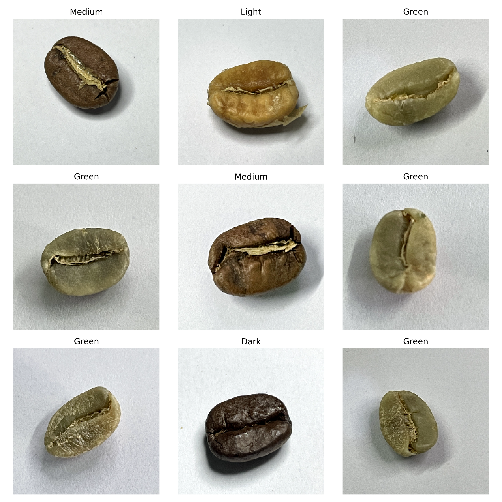
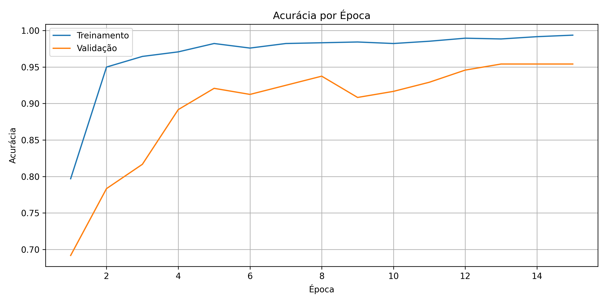
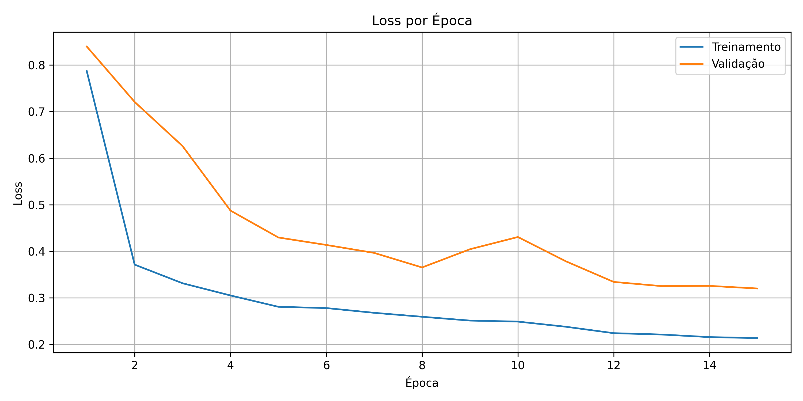
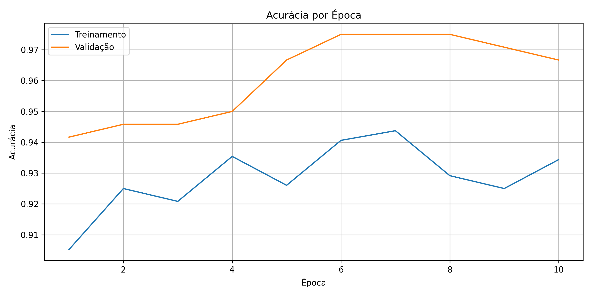
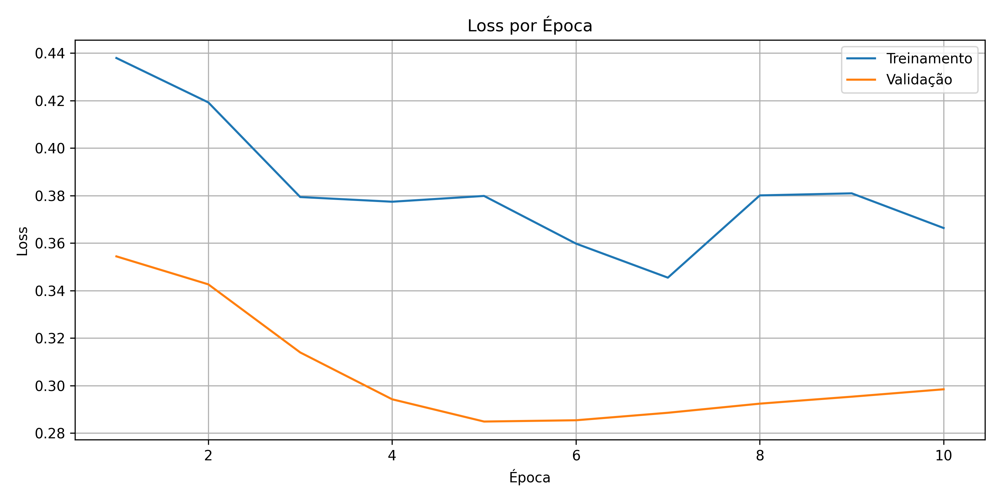
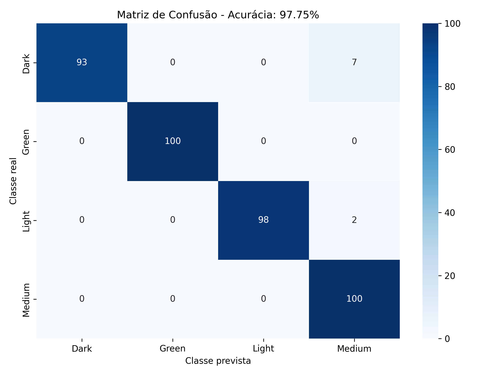
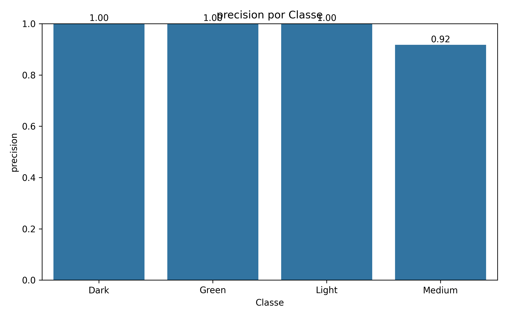
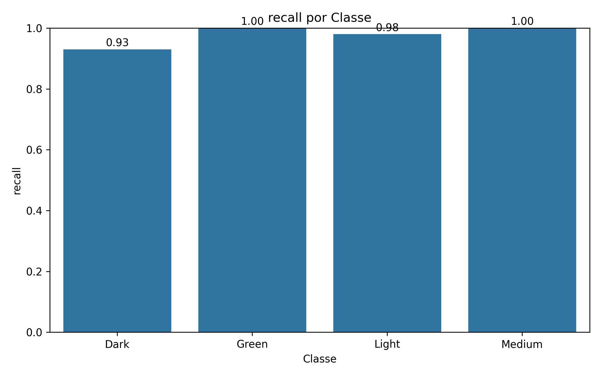
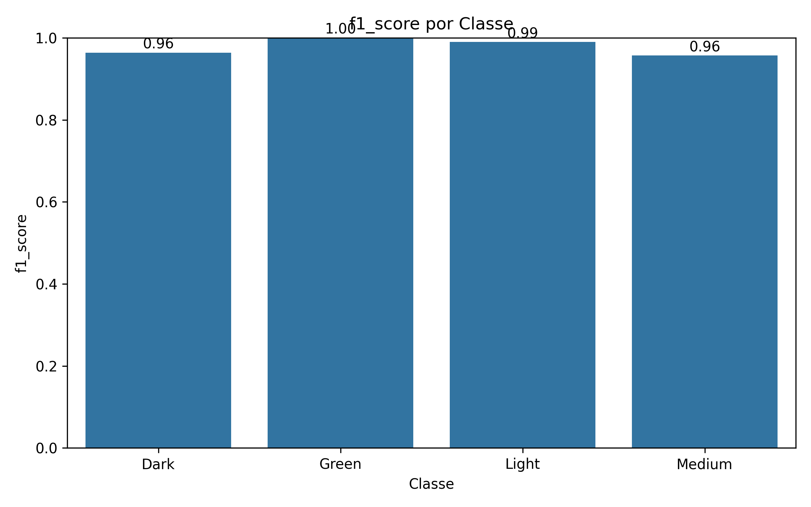

# Classificação de Grãos de Café com EfficientNetB0 e Fine-Tuning

Projeto final desenvolvido para a disciplina de **Processamento de Imagens**, com o objetivo de aplicar e avaliar uma abordagem de **classificação de imagens** utilizando uma **rede neural convolucional pré-treinada** com **fine-tuning**.

O projeto utiliza o **Coffee Bean Dataset Resized 224x224** para classificar imagens de grãos de café em quatro classes:

* `Dark`
* `Green`
* `Light`
* `Medium`

---

## Equipe

| Nome                                        |      RA |
| ------------------------------------------- | ------: |
| Álison Christian Rebouças Vidal de Carvalho | 2565765 |
| Carlos Eduardo Pires de Santana Hereman     | 2565803 |

---

## Links

* **Repositório do projeto:** https://github.com/AlisonCarv/classificacao-cafe-efficientnet
* **Dataset utilizado:** https://www.kaggle.com/datasets/gpiosenka/coffee-bean-dataset-resized-224-x-224
* **Vídeo de apresentação:** COLE_AQUI_O_LINK_DO_VIDEO

---

## Objetivo

O objetivo deste projeto é treinar e avaliar um modelo de classificação de imagens capaz de identificar o grau de torra ou estado visual de grãos de café a partir de imagens coloridas.

Para isso, foi utilizada uma abordagem baseada em **CNN pré-treinada**, aproveitando o conhecimento previamente aprendido por uma rede treinada na base ImageNet e adaptando-a ao dataset específico de grãos de café.

---

## Dataset

O dataset utilizado foi o **Coffee Bean Dataset Resized 224x224**, disponível publicamente no Kaggle.

A estrutura original utilizada no projeto foi:

```text
Kaggle Coffee Bean Dataset/
├── Coffee Bean.csv
├── train/
│   ├── Dark/
│   ├── Green/
│   ├── Light/
│   └── Medium/
└── test/
    ├── Dark/
    ├── Green/
    ├── Light/
    └── Medium/
```

O dataset contém imagens coloridas de grãos de café redimensionadas para **224x224 pixels**.

A pasta `train/` foi utilizada para gerar os conjuntos de **treinamento** e **validação** por meio de `validation_split=0.20`. A pasta `test/` foi mantida separada e utilizada apenas para a avaliação final do modelo.

| Conjunto    | Origem                | Uso                                           |
| ----------- | --------------------- | --------------------------------------------- |
| Treinamento | 80% da pasta `train/` | Treinar as camadas ajustáveis do modelo       |
| Validação   | 20% da pasta `train/` | Acompanhar o desempenho durante o treinamento |
| Teste       | 100% da pasta `test/` | Avaliar o modelo final                        |

O conjunto de teste utilizado na avaliação final possui **400 imagens**, distribuídas em 100 imagens por classe.

---

## Amostras do dataset

A figura abaixo apresenta exemplos de imagens carregadas durante a execução do projeto.



---

## Abordagem utilizada

A abordagem escolhida foi:

> **Classificação de imagens com CNN pré-treinada e fine-tuning.**

O modelo base utilizado foi a **EfficientNetB0**, carregada com pesos pré-treinados da **ImageNet**.

A EfficientNetB0 foi utilizada com `include_top=False`, ou seja, sem a camada de classificação original. Em seguida, foram adicionadas novas camadas ao topo do modelo para adaptar a rede ao problema de classificação das quatro classes do Coffee Bean Dataset.

A arquitetura final foi composta por:

1. Entrada para imagens `224x224x3`.
2. Camadas de aumento de dados.
3. Pré-processamento específico da EfficientNet.
4. Modelo base `EfficientNetB0`.
5. Camada `GlobalAveragePooling2D`.
6. Camada `BatchNormalization`.
7. Camada densa com 128 neurônios e ativação `relu`.
8. Regularização L2.
9. Camada `Dropout` com taxa de 0.4.
10. Camada de saída `Dense` com ativação `softmax`.

A camada final possui quatro neurônios, correspondentes às classes:

* `Dark`
* `Green`
* `Light`
* `Medium`

---

## Aumento de dados

Para melhorar a generalização do modelo e reduzir o risco de overfitting, foram utilizadas camadas de aumento de dados diretamente na arquitetura da rede.

As transformações aplicadas foram:

```python
RandomFlip("horizontal")
RandomRotation(0.08)
RandomZoom(0.10)
RandomContrast(0.15)
```

Essas transformações criam variações nas imagens durante o treinamento, simulando pequenas mudanças de orientação, escala e contraste.

---

## Treinamento

O treinamento foi dividido em duas fases.

### Fase 1 — Transfer Learning

Na primeira fase, a base convolucional da EfficientNetB0 foi mantida congelada. Dessa forma, apenas as camadas adicionadas ao topo da rede foram treinadas.

| Parâmetro             | Valor                    |
| --------------------- | ------------------------ |
| Modelo base           | EfficientNetB0           |
| Pesos iniciais        | ImageNet                 |
| Tamanho da imagem     | 224x224                  |
| Batch size            | 32                       |
| Épocas                | 15                       |
| Learning rate inicial | 0.001                    |
| Otimizador            | Adam                     |
| Função de perda       | Categorical Crossentropy |
| Métrica principal     | Accuracy                 |

### Histórico da fase 1





Na fase inicial, a acurácia de treinamento e validação apresentou crescimento progressivo, indicando que as camadas adicionadas ao topo da EfficientNetB0 conseguiram aprender padrões relevantes do dataset.

---

### Fase 2 — Fine-Tuning

Na segunda fase, foi realizado o **fine-tuning**. As últimas camadas da EfficientNetB0 foram descongeladas, permitindo que parte da rede pré-treinada fosse ajustada ao domínio específico das imagens de grãos de café.

| Parâmetro         | Valor                                |
| ----------------- | ------------------------------------ |
| Camadas liberadas | Últimas 30 camadas da EfficientNetB0 |
| Learning rate     | 0.00001                              |
| Otimizador        | Adam                                 |
| Função de perda   | Categorical Crossentropy             |
| Métrica principal | Accuracy                             |

### Histórico da fase 2





Na fase de fine-tuning, a validação se manteve em patamar elevado, chegando a aproximadamente 97,5% durante o treinamento. A taxa de aprendizado menor foi utilizada para evitar alterações bruscas nos pesos pré-treinados da EfficientNetB0.

---

## Callbacks utilizados

Durante o treinamento, foram utilizados os seguintes callbacks:

| Callback            | Função                                                                  |
| ------------------- | ----------------------------------------------------------------------- |
| `ModelCheckpoint`   | Salvar os melhores pesos com base na acurácia de validação              |
| `EarlyStopping`     | Interromper o treinamento caso a perda de validação parasse de melhorar |
| `ReduceLROnPlateau` | Reduzir a taxa de aprendizado quando a perda de validação estabilizasse |
| `CSVLogger`         | Registrar o histórico de treinamento em arquivo CSV                     |

---

## Bibliotecas utilizadas

As principais bibliotecas utilizadas foram:

* TensorFlow
* Keras
* NumPy
* Pandas
* Matplotlib
* Seaborn
* Scikit-learn
* Pillow

---

## Estrutura do projeto

```text
classificacao-cafe-efficientnet/
├── README.md
├── notebook_colab.ipynb
├── requirements.txt
├── src/
│   ├── __init__.py
│   ├── config.py
│   ├── dados.py
│   ├── modelo.py
│   ├── treino.py
│   ├── avaliacao.py
│   └── visualizacao.py
└── outputs/
    ├── figuras/
    │   ├── amostras_dataset.png
    │   ├── fase_1_acuracia.png
    │   ├── fase_1_loss.png
    │   ├── fase_2_acuracia.png
    │   ├── fase_2_loss.png
    │   ├── matriz_confusao.png
    │   ├── precision.png
    │   ├── recall.png
    │   └── f1_score.png
    ├── logs/
    │   └── historico_treinamento.csv
    └── metricas/
        └── relatorio_classificacao.txt
```

---

## Principais arquivos

| Arquivo                                        | Descrição                                                            |
| ---------------------------------------------- | -------------------------------------------------------------------- |
| `notebook_colab.ipynb`                         | Notebook principal utilizado para execução no Google Colab           |
| `requirements.txt`                             | Lista de bibliotecas utilizadas no projeto                           |
| `src/config.py`                                | Configurações gerais, caminhos e hiperparâmetros                     |
| `src/dados.py`                                 | Carregamento do CSV e dos conjuntos de treino, validação e teste     |
| `src/modelo.py`                                | Criação da arquitetura EfficientNetB0 com camadas adicionais         |
| `src/treino.py`                                | Compilação, callbacks e treinamento do modelo                        |
| `src/avaliacao.py`                             | Avaliação do modelo, matriz de confusão e relatório de classificação |
| `src/visualizacao.py`                          | Geração de gráficos de amostras, histórico e métricas                |
| `outputs/figuras/`                             | Figuras geradas durante treinamento e avaliação                      |
| `outputs/logs/historico_treinamento.csv`       | Histórico registrado pelo treinamento                                |
| `outputs/metricas/relatorio_classificacao.txt` | Relatório final com acurácia, precisão, recall e F1-score            |

---

## Resultados obtidos

A avaliação final foi realizada no conjunto de teste, composto por **400 imagens**, sendo **100 imagens por classe**.

### Acurácia final

```text
Acurácia: 0.9775
```

A acurácia final obtida foi:

```text
97,75%
```

---

## Matriz de confusão



A matriz de confusão obtida foi:

| Classe real \ Classe prevista | Dark | Green | Light | Medium |
| ----------------------------- | ---: | ----: | ----: | -----: |
| Dark                          |   93 |     0 |     0 |      7 |
| Green                         |    0 |   100 |     0 |      0 |
| Light                         |    0 |     0 |    98 |      2 |
| Medium                        |    0 |     0 |     0 |    100 |

A matriz mostra que o modelo classificou corretamente todas as imagens das classes `Green` e `Medium`. Os erros ocorreram principalmente entre as classes `Dark` e `Medium`, além de dois casos em que imagens da classe `Light` foram classificadas como `Medium`.

---

## Métricas por classe

| Classe | Precision | Recall | F1-score | Support |
| ------ | --------: | -----: | -------: | ------: |
| Dark   |    1.0000 | 0.9300 |   0.9637 |     100 |
| Green  |    1.0000 | 1.0000 |   1.0000 |     100 |
| Light  |    1.0000 | 0.9800 |   0.9899 |     100 |
| Medium |    0.9174 | 1.0000 |   0.9569 |     100 |

### Médias gerais

| Métrica      | Precision | Recall | F1-score | Support |
| ------------ | --------: | -----: | -------: | ------: |
| Accuracy     |         - |      - |   0.9775 |     400 |
| Macro avg    |    0.9794 | 0.9775 |   0.9776 |     400 |
| Weighted avg |    0.9794 | 0.9775 |   0.9776 |     400 |

---

## Gráficos das métricas

### Precision por classe



### Recall por classe



### F1-score por classe



---

## Interpretação dos resultados

O modelo apresentou desempenho elevado no conjunto de teste, com **97,75% de acurácia**.

A classe `Green` obteve desempenho perfeito, com precision, recall e F1-score iguais a 1.0000. A classe `Medium` também obteve recall igual a 1.0000, indicando que todas as imagens reais dessa classe foram corretamente reconhecidas. Entretanto, a precision da classe `Medium` foi menor, com valor de 0.9174, porque algumas imagens das classes `Dark` e `Light` foram classificadas como `Medium`.

A classe `Dark` apresentou precision igual a 1.0000, mas recall de 0.9300. Isso significa que, quando o modelo previu `Dark`, ele acertou todas as previsões; porém, sete imagens reais da classe `Dark` foram classificadas como `Medium`.

A classe `Light` apresentou desempenho alto, com F1-score de 0.9899, tendo apenas duas imagens classificadas incorretamente como `Medium`.

De forma geral, o modelo teve maior dificuldade em distinguir algumas imagens próximas visualmente entre `Dark`, `Medium` e `Light`, o que é esperado em problemas de classificação de graus de torra, pois as diferenças podem ser graduais.

---

## Diferenças em relação ao código exemplo da disciplina

O código exemplo da disciplina utilizava uma CNN pré-treinada baseada na arquitetura **MobileNetV2**.

Neste projeto, foram feitas as seguintes adaptações:

| Item                    | Código exemplo                    | Projeto desenvolvido                                            |
| ----------------------- | --------------------------------- | --------------------------------------------------------------- |
| Modelo base             | MobileNetV2                       | EfficientNetB0                                                  |
| Dataset                 | Coffee Bean Dataset               | Coffee Bean Dataset                                             |
| Carregamento de imagens | `ImageDataGenerator`              | `image_dataset_from_directory`                                  |
| Validação               | Pasta separada de validação       | `validation_split=0.20` a partir da pasta `train/`              |
| Treinamento             | Modelo base congelado             | Treinamento em duas fases                                       |
| Fine-tuning             | Não utilizado como etapa separada | Descongelamento das últimas 30 camadas                          |
| Learning rate           | Valor único                       | 0.001 na fase 1 e 0.00001 na fase 2                             |
| Aumento de dados        | Transformações simples            | `RandomFlip`, `RandomRotation`, `RandomZoom` e `RandomContrast` |
| Saída                   | `softmax`                         | `softmax`                                                       |
| Métricas                | Métricas obrigatórias             | Métricas obrigatórias, gráficos e relatório final               |

---

## Como executar o projeto

O ambiente utilizado para execução foi o **Google Colab**, com o dataset armazenado no Google Drive.

### 1. Clonar o repositório no Colab

```python
import os
import subprocess

REPO_URL = "https://github.com/AlisonCarv/classificacao-cafe-efficientnet.git"
REPO_DIR = "/content/classificacao-cafe-efficientnet"

if os.path.exists(REPO_DIR):
    print("Repositório já existe no Colab. Atualizando...")
    subprocess.run(["git", "-C", REPO_DIR, "pull"], check=True)
else:
    print("Clonando repositório...")
    subprocess.run(["git", "clone", REPO_URL, REPO_DIR], check=True)

os.chdir(REPO_DIR)
print("Diretório atual:", os.getcwd())
```

### 2. Instalar dependências

```python
!pip install -q -r requirements.txt
```

### 3. Montar o Google Drive

```python
from google.colab import drive
drive.mount('/content/drive')
```

### 4. Estrutura esperada do dataset no Drive

O projeto espera que o dataset esteja no seguinte caminho:

```text
/content/drive/MyDrive/Colab Notebooks/Kaggle Coffee Bean Dataset
```

Com a estrutura:

```text
Kaggle Coffee Bean Dataset/
├── Coffee Bean.csv
├── train/
│   ├── Dark/
│   ├── Green/
│   ├── Light/
│   └── Medium/
└── test/
    ├── Dark/
    ├── Green/
    ├── Light/
    └── Medium/
```

### 5. Executar o notebook

Após clonar o repositório e montar o Drive, execute o arquivo:

```text
notebook_colab.ipynb
```

O notebook executa as seguintes etapas:

1. Montagem do Google Drive.
2. Verificação da estrutura do dataset.
3. Leitura do arquivo `Coffee Bean.csv`.
4. Carregamento das imagens de treino, validação e teste.
5. Visualização de amostras do dataset.
6. Criação do modelo EfficientNetB0.
7. Treinamento inicial com a base congelada.
8. Fine-tuning das últimas camadas.
9. Avaliação no conjunto de teste.
10. Geração da matriz de confusão, gráficos de métricas e relatório final.

---

## Observações sobre o repositório

O dataset não foi incluído no repositório, pois está disponível publicamente no Kaggle e deve ser baixado separadamente.

Arquivos de modelo e checkpoints podem ser omitidos do repositório devido ao tamanho. Os principais resultados necessários para avaliação estão disponíveis na pasta `outputs/`.

---

## Conclusão

O modelo EfficientNetB0 com transfer learning e fine-tuning apresentou desempenho elevado na classificação das quatro classes de grãos de café, alcançando **97,75% de acurácia** no conjunto de teste.

Os resultados indicam que a abordagem com CNN pré-treinada foi adequada para o problema, especialmente porque o dataset possui imagens padronizadas em 224x224 pixels e classes visualmente distinguíveis. A etapa de fine-tuning permitiu adaptar parte da rede ao domínio específico das imagens de grãos de café, contribuindo para a melhora do desempenho final.

Os erros observados se concentraram principalmente em confusões entre classes visualmente próximas, especialmente imagens reais de `Dark` e `Light` classificadas como `Medium`.
